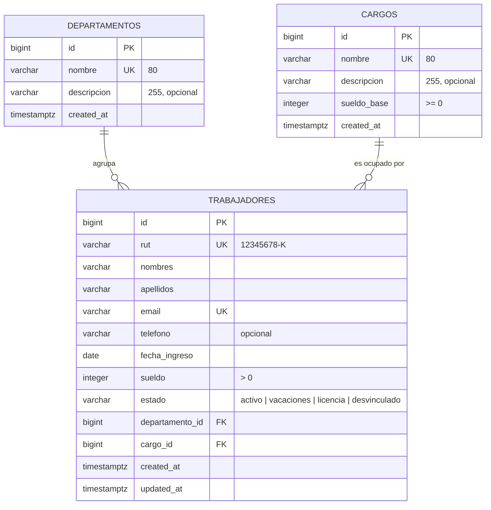

# Diseño de la base de datos — TalentoRH

Motor: **PostgreSQL en Supabase**. Scripts: [`supabase/01_esquema.sql`](../supabase/01_esquema.sql) (estructura) y [`supabase/02_datos_ficticios.sql`](../supabase/02_datos_ficticios.sql) (datos de prueba).

## Modelo entidad–relación



- Un **departamento** tiene muchos trabajadores; cada trabajador pertenece a **un** departamento (1 : N).
- Un **cargo** puede ser ocupado por muchos trabajadores; cada trabajador tiene **un** cargo (1 : N).

## Tablas

### `departamentos`
| Campo | Tipo | Restricciones | Descripción |
|---|---|---|---|
| `id` | `bigint` | PK, identity | Identificador automático |
| `nombre` | `varchar(80)` | NOT NULL, UNIQUE | Nombre del área |
| `descripcion` | `varchar(255)` | — | Qué hace el área |
| `created_at` | `timestamptz` | default `now()` | Fecha de creación |

### `cargos`
| Campo | Tipo | Restricciones | Descripción |
|---|---|---|---|
| `id` | `bigint` | PK, identity | Identificador automático |
| `nombre` | `varchar(80)` | NOT NULL, UNIQUE | Nombre del puesto |
| `descripcion` | `varchar(255)` | — | Funciones principales |
| `sueldo_base` | `integer` | NOT NULL, `>= 0` | Sueldo referencial en CLP |
| `created_at` | `timestamptz` | default `now()` | Fecha de creación |

### `trabajadores`
| Campo | Tipo | Restricciones | Descripción |
|---|---|---|---|
| `id` | `bigint` | PK, identity | Identificador automático |
| `rut` | `varchar(12)` | NOT NULL, UNIQUE | RUT ficticio, guardado como `12345678-K` |
| `nombres` | `varchar(60)` | NOT NULL | |
| `apellidos` | `varchar(60)` | NOT NULL | |
| `email` | `varchar(120)` | NOT NULL, UNIQUE | Correo laboral (ficticio) |
| `telefono` | `varchar(20)` | — | |
| `fecha_ingreso` | `date` | NOT NULL | La app valida que no sea futura |
| `sueldo` | `integer` | NOT NULL, `> 0` | Sueldo bruto mensual en CLP |
| `estado` | `varchar(20)` | NOT NULL, CHECK en lista | `activo`, `vacaciones`, `licencia`, `desvinculado` |
| `departamento_id` | `bigint` | FK → `departamentos.id`, ON DELETE RESTRICT | |
| `cargo_id` | `bigint` | FK → `cargos.id`, ON DELETE RESTRICT | |
| `created_at` / `updated_at` | `timestamptz` | `updated_at` se actualiza con un *trigger* | Auditoría básica |

Índices: `departamento_id`, `cargo_id` y `estado`, que son las columnas por las que se filtra.

## Seguridad (Row Level Security)

Las tres tablas tienen **RLS activado** y una política que solo permite operar al rol `authenticated`:

```sql
create policy "Autenticados gestionan trabajadores"
  on public.trabajadores for all to authenticated
  using (true) with check (true);
```

- Sin sesión (rol `anon`), **no se puede leer ni modificar nada**, aunque alguien consiga la clave pública.
- Flask envía en cada consulta el **token del usuario conectado** (`Authorization: Bearer …`), no una clave maestra. Por eso el proyecto **no usa** la clave `service_role`.

## Decisiones de diseño

| Decisión | Motivo |
|---|---|
| `ON DELETE RESTRICT` en las claves foráneas | Evita dejar trabajadores "huérfanos". Si se intenta borrar un departamento con personal, la BD lo impide y la app muestra un mensaje claro. |
| `UNIQUE` en `rut`, `email` y `nombre` | Evita duplicados aunque dos personas guarden al mismo tiempo. La app traduce el error `23505` a "Ya existe un registro con ese RUT". |
| `estado` con `CHECK` en vez de otra tabla | Son 4 valores fijos que el código usa directamente (colores, filtros). Una tabla adicional no aporta. |
| `integer` para sueldos | El peso chileno no usa decimales. |
| RUT guardado sin puntos (`12345678-K`) | Un solo formato facilita la búsqueda y la unicidad. Los puntos se agregan solo al mostrarlo. |
| Validar también en la app (Python) | La BD es la última barrera; la app da mensajes más amables y valida reglas que la BD no conoce (dígito verificador del RUT, fecha no futura). |
| Sin tabla de usuarios propia | Los usuarios los gestiona **Supabase Auth** (`auth.users`), que guarda la contraseña de forma segura (hash). |

## Consultas que hace la aplicación

| Acción | Consulta con supabase-py |
|---|---|
| Listar trabajadores con su área y cargo | `table("trabajadores").select("*, departamento:departamentos(nombre), cargo:cargos(nombre)")` |
| Buscar | `.or_("nombres.ilike.*texto*,apellidos.ilike.*texto*,email.ilike.*texto*")` |
| Filtrar | `.eq("departamento_id", 3).eq("estado", "activo")` |
| Departamentos con cantidad de trabajadores | `table("departamentos").select("*, trabajadores(count)")` |
| Crear / modificar / eliminar | `.insert({...})`, `.update({...}).eq("id", id)`, `.delete().eq("id", id)` |
