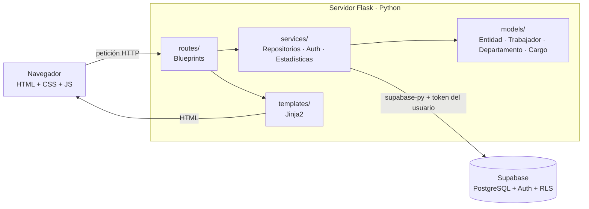

# Planificación del proyecto — TalentoRH

> Evaluación II y III · Programación Orientada a Objeto · 4º Medio H
> Contexto elegido: **B. Gestión de Recursos Humanos**
> Entrega: **martes 29 de septiembre de 2026** (impostergable)

---

## 1. Contexto y problema

**Organización (ficticia):** *Comercial Los Andes SpA*, empresa mediana de distribución con unas 120 personas repartidas en 5 áreas: Administración y Finanzas, Operaciones, Ventas, Tecnología y Recursos Humanos.

**Situación actual:** el área de RR.HH. guarda la información del personal en planillas Excel que cada jefatura copia y modifica por su cuenta. Esto provoca que:

- existan **datos duplicados o desactualizados** (el mismo trabajador aparece con distinto cargo en dos archivos);
- no se sepa rápidamente **cuántas personas están activas, de vacaciones o con licencia**, lo que complica organizar turnos y reemplazos;
- calcular la **nómina mensual** o el personal por área requiere sumar a mano;
- cualquiera con acceso a la carpeta compartida puede ver o borrar datos (**sin control de acceso**);
- se ingresan **RUT o correos mal escritos** porque nada los valida.

**Problema a resolver:** RR.HH. necesita un sistema web centralizado y protegido con contraseña para registrar al personal, mantener sus datos consistentes y ver indicadores del equipo sin cálculos manuales.

**Relevancia:** la información del personal es la base de remuneraciones, planificación de turnos y cumplimiento laboral. Tener errores ahí implica pagos incorrectos, áreas sin cobertura y pérdida de tiempo administrativo.

## 2. Usuarios del sistema

| Usuario | Qué necesita hacer |
|---|---|
| **Encargado/a de RR.HH.** (usuario principal) | Registrar, modificar y dar de baja trabajadores; mantener departamentos y cargos; buscar personas rápidamente. |
| **Gerencia / jefaturas** | Revisar el dashboard: dotación por área, ausencias y costo de la nómina. |

En esta versión todos los usuarios autenticados tienen los mismos permisos. Separar roles (administrador y solo consulta) queda como mejora, ver el [backlog](#9-backlog-de-mejoras-para-repartir).

## 3. Requerimientos funcionales

| ID | Requerimiento | Dónde está |
|---|---|---|
| **RF01** | El sistema debe permitir iniciar sesión con correo y contraseña (Supabase Auth). | `routes/auth.py` |
| **RF02** | El sistema debe permitir cerrar sesión. | `routes/auth.py` |
| **RF03** | Las páginas internas solo deben ser accesibles con sesión iniciada; si no, redirigen al login. | `utils/seguridad.py` |
| **RF04** | El dashboard debe mostrar: trabajadores vigentes, activos, ausentes (vacaciones/licencia), nómina mensual, sueldo promedio, gráfico por departamento, gráfico por estado y últimos ingresos. | `routes/dashboard.py`, `services/estadisticas.py` |
| **RF05** | Se debe poder registrar un trabajador (RUT, nombres, apellidos, correo, teléfono, departamento, cargo, fecha de ingreso, sueldo y estado). | `routes/trabajadores.py` |
| **RF06** | Se debe poder ver el listado de trabajadores con su departamento, cargo, antigüedad, sueldo y estado. | `trabajadores/lista.html` |
| **RF07** | Se debe poder modificar los datos de un trabajador. | `routes/trabajadores.py` |
| **RF08** | Se debe poder eliminar un trabajador, previa confirmación. | `routes/trabajadores.py`, `app.js` |
| **RF09** | Se debe poder buscar trabajadores por nombre, apellido, RUT o correo, y filtrarlos por departamento y estado. | `RepositorioTrabajadores.buscar()` |
| **RF10** | Se debe poder registrar, ver, modificar y eliminar departamentos. No se puede eliminar un departamento con trabajadores asociados. | `routes/departamentos.py` |
| **RF11** | Se debe poder registrar, ver, modificar y eliminar cargos con su sueldo base. Al elegir un cargo en el formulario se sugiere su sueldo base. | `routes/cargos.py`, `app.js` |
| **RF12** | Los formularios deben validar: campos obligatorios, RUT con dígito verificador, formato de correo, fecha de ingreso no futura, sueldo positivo y datos no duplicados (RUT, correo, nombre de departamento/cargo). La validación se hace en el navegador (JS) **y** en el servidor (Python). | `models/*.py`, `app.js` |
| **RF13** | El sistema debe mostrar mensajes claros de éxito, error y confirmación con SweetAlert2. | `app.js`, `base.html` |

### Requerimientos no funcionales

- **Seguridad:** las claves van en `.env` (nunca en GitHub). La base de datos tiene RLS, así que sin sesión no se puede leer ni escribir.
- **Usabilidad:** la interfaz es *responsive* (computador y celular) y usa un lenguaje claro en español.
- **Datos:** se usan exclusivamente datos ficticios.
- **Mantenibilidad:** el código está separado en capas (rutas, servicios, modelos, vistas) y hay una clase por entidad.

## 4. Propuesta de solución

Una aplicación web **Flask + Supabase** llamada **TalentoRH**:

1. El usuario de RR.HH. inicia sesión y llega a un **dashboard** con los indicadores del personal.
2. Desde el menú lateral administra **Trabajadores**, **Departamentos** y **Cargos** (CRUD completo).
3. El listado de trabajadores tiene **buscador y filtros** para encontrar a una persona en segundos.
4. Todo dato se **valida dos veces**: en el navegador, para dar una respuesta inmediata, y en el servidor, que es la validación que no se puede saltar.
5. La información vive en una sola base de datos en la nube (Supabase), protegida con RLS.

## 5. Arquitectura

| Tecnología | Rol en el proyecto |
|---|---|
| **HTML (Jinja2)** | Estructura de las páginas. `base.html` → `panel.html` → cada vista (herencia de plantillas). |
| **CSS** | Diseño propio en `static/css/styles.css`: variables de color, componentes y *responsive*. |
| **JavaScript** | `static/js/app.js`: SweetAlert2 (mensajes/confirmaciones), validación y formato de RUT, sugerencia de sueldo, gráficos Chart.js, menú móvil. |
| **Flask** | Servidor web: rutas (Blueprints), sesión del usuario y validación en el servidor. |
| **Supabase** | Autenticación (correo/contraseña) y base de datos PostgreSQL con políticas RLS. |

**Flujo de una petición (ejemplo: registrar trabajador):**
`formulario (JS valida)` → `POST /trabajadores/nuevo` → `Trabajador.desde_formulario()` → `trabajador.validar()` → `RepositorioTrabajadores.crear()` → Supabase `INSERT` (RLS verifica el token) → `flash("…registrado")` → redirección → SweetAlert2 muestra el mensaje.

## 6. Programación Orientada a Objetos en el proyecto

| Concepto | Dónde se aplica |
|---|---|
| **Clases y objetos** | `Trabajador`, `Departamento`, `Cargo`, `RepositorioTrabajadores`, `ServicioAutenticacion`, `ServicioEstadisticas`… Cada fila de la BD se convierte en un objeto. |
| **Abstracción** | `Entidad` (clase abstracta, `ABC`) define qué debe saber hacer toda entidad: `validar()`, `a_dict()`, `desde_dict()`. |
| **Herencia** | `Trabajador`, `Departamento` y `Cargo` heredan de `Entidad`. `RepositorioTrabajadores`, `RepositorioDepartamentos` y `RepositorioCargos` heredan el CRUD de `Repositorio`. |
| **Polimorfismo** | `validar()` llama a `_reglas()`, y cada subclase la implementa distinto. Las rutas llaman `entidad.validar()` sin saber qué tipo de entidad es. |
| **Encapsulamiento** | Los errores se guardan en `_errores` (protegido) y se leen con la propiedad `errores`. El cliente de Supabase se guarda en `_cliente`. |
| **Propiedades** (`@property`) | `nombre_completo`, `antiguedad_anios`, `iniciales`, `esta_vigente`. |
| **Métodos de clase** | `desde_dict()` y `desde_formulario()` crean objetos a partir de datos. |
| **Excepciones propias** | `ErrorDatos` y `ErrorAutenticacion` traducen errores técnicos a mensajes para el usuario. |

## 7. Organización del equipo (6 integrantes)

Cada persona **es dueña de una parte**: la estudia hasta poder explicarla, la prueba, la mejora con sus propios commits y la documenta en el informe. Si el equipo es más chico, se juntan los roles 5 y 6 o los roles 3 y 4.

| # | Rol | Archivos a cargo | Qué debe poder explicar |
|---|---|---|---|
| 1 | **Base de datos y Supabase** (líder técnico) | `supabase/*.sql`, `services/conexion.py`, `services/repositorios.py` | Tablas, relaciones, RLS, cómo Flask consulta Supabase y cómo se traducen los errores. |
| 2 | **Autenticación y seguridad** | `routes/auth.py`, `services/autenticacion.py`, `utils/seguridad.py`, `config.py`, `.env.example`, `.gitignore` | Login, sesión, decorador `login_requerido`, renovación del token y por qué `.env` no se sube. |
| 3 | **Módulo Trabajadores** | `models/trabajador.py`, `routes/trabajadores.py`, `templates/trabajadores/` | CRUD completo, búsqueda y filtros, validaciones del trabajador (RUT). |
| 4 | **Departamentos, Cargos y POO** | `models/entidad.py`, `models/departamento.py`, `models/cargo.py`, sus rutas y plantillas | Clase abstracta, herencia y polimorfismo; por qué no se puede borrar un departamento con personal. |
| 5 | **Dashboard y JavaScript** | `services/estadisticas.py`, `routes/dashboard.py`, `templates/dashboard.html`, `static/js/app.js` | Cálculo de indicadores, Chart.js, SweetAlert2 y validación en el navegador. |
| 6 | **Diseño, pruebas e informe** | `static/css/styles.css`, `templates/base.html`, `panel.html`, `login.html`, `docs/PRUEBAS.md` | Diseño y *responsive*, plan de pruebas y evidencias. Coordina el informe. |

**Todos:** ejecutar el proyecto en su computador, hacer al menos 4 pruebas de `docs/PRUEBAS.md` con captura, y escribir en el informe la sección de su parte.

## 8. Cronograma

| Día | Tareas | Responsable |
|---|---|---|
| **Jue 24/09** | Base del proyecto lista. Crear repositorio GitHub e invitar al equipo. Crear proyecto Supabase, ejecutar los SQL y crear el usuario de prueba. | 1, 2 |
| **Vie 25/09** | Cada integrante clona el repo, crea su `.env`, ejecuta la app y **lee a fondo sus archivos**. Se elige una mejora del backlog por persona. | Todos |
| **Sáb 26 – Dom 27** | Desarrollar las mejoras en ramas propias con *pull request*. Ejecutar las pruebas de `PRUEBAS.md` contra Supabase real y tomar las capturas. | Todos |
| **Lun 28/09** | Cerrar el informe (usar `docs/GUIA_INFORME.md`), completar el README con los nombres, revisar la [lista de entrega](#10-lista-de-entrega-según-rúbrica) y ensayar la presentación. | 6 + todos |
| **Mar 29/09** | Entrega y presentación. | Todos |

### Forma de trabajo en GitHub

1. `main` siempre debe funcionar. Nadie sube directo a `main`.
2. Cada tarea va en una rama: `git checkout -b mejora/ficha-trabajador`.
3. Se hacen commits pequeños y descriptivos, como `Agrega paginación al listado de trabajadores`.
4. Se abre un *pull request* y otro integrante lo revisa antes de unirlo.
5. **Nunca** se hace `git add .env`. Antes de cada commit, revisen `git status`.

> Los commits y *pull requests* de cada integrante son la evidencia de colaboración que pide la rúbrica, así que cada persona debe subir su propio trabajo desde su cuenta.

## 9. Backlog de mejoras (para repartir)

Ordenado de menor a mayor dificultad. Cada integrante debería tomar **al menos una**.

- [ ] Ficha de detalle del trabajador (`/trabajadores/<id>`) con todos sus datos y su antigüedad.
- [ ] Buscar por nombre completo (por ejemplo "Camila Rojas") separando las palabras.
- [ ] Ordenar el listado al hacer clic en el encabezado de una columna.
- [ ] Paginación del listado (usando `.range()` de Supabase).
- [ ] Exportar el listado filtrado a CSV.
- [ ] Nuevo indicador en el dashboard: antigüedad promedio o aniversarios del mes.
- [ ] Botón para cambiar el estado de un trabajador directamente desde el listado.
- [ ] Modo oscuro con variables CSS.
- [ ] Roles: tabla `perfiles` (`admin` / `consulta`) y políticas RLS según el rol.
- [ ] Módulo de ausencias: tabla `ausencias` (trabajador, tipo, fecha inicio/fin) que actualice el estado del trabajador.

## 10. Lista de entrega (según rúbrica)

**Aplicación**
- [ ] Login con correo y contraseña funcionando contra Supabase.
- [ ] Dashboard con indicadores reales.
- [ ] CRUD de trabajadores, departamentos y cargos probado.
- [ ] Búsqueda y filtros funcionando.
- [ ] Validaciones y mensajes SweetAlert2 probados, incluidos los casos de error.
- [ ] Solo datos ficticios.

**Repositorio GitHub**
- [ ] `README.md` con instalación, ejecución y nombres del equipo.
- [ ] `requirements.txt`, `.gitignore` y `.env.example` sin claves reales.
- [ ] **Sin** `.env` ni `venv/` (revisar en la web de GitHub).
- [ ] Commits de todos los integrantes.

**Informe y presentación**
- [ ] Informe con las 13 secciones (ver `docs/GUIA_INFORME.md`).
- [ ] Tabla de pruebas completa con resultados obtenidos.
- [ ] Capturas: login, dashboard, formularios, validaciones, alertas, Supabase (tablas y usuarios) y GitHub.
- [ ] Enlace al repositorio en el informe.
- [ ] Cada integrante puede explicar su parte técnica.
